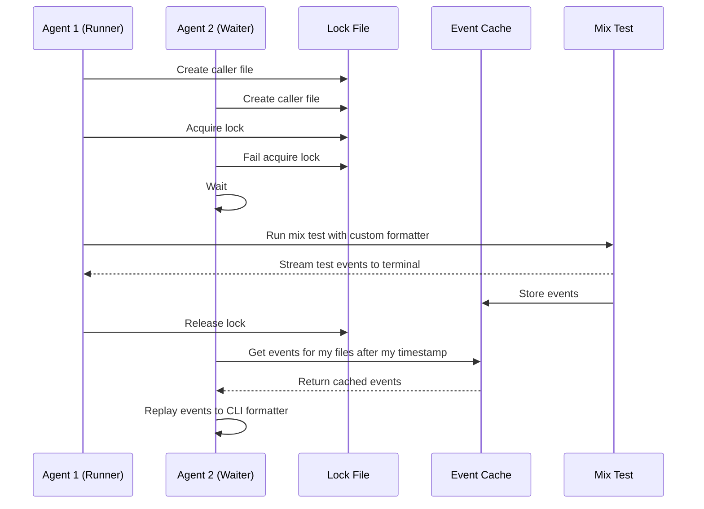

# ClientUtils

An ExUnit formatter with JSON output and distributed test coordination. Designed for editor integrations and CI/CD pipelines that need machine-readable test results and the ability to handle concurrent test requests.

## Features

- **JSON Output** - Machine-readable test results
- **Streaming Mode** - Real-time JSON events as tests complete
- **Distributed Test Coordination** - Multiple concurrent test requests are serialized, with results cached and replayed to waiting callers
- **CLI Passthrough** - Standard ExUnit terminal output is preserved

## Installation

```elixir
def deps do
  [{:client_utils, "~> 0.1.0"}]
end
```

## Basic Usage

Configure the formatter in `test/test_helper.exs`:

```elixir
ExUnit.start(formatters: [ClientUtils.TestFormatter])
```

### File Output

```elixir
ExUnit.start(formatters: [{ClientUtils.TestFormatter, output_file: "test-results.json"}])
```

Or via environment variable:

```bash
EXUNIT_JSON_OUTPUT_FILE=test-results.json mix test
```

### Streaming Mode

Stream test events in real-time while writing the final summary to a file:

```elixir
ExUnit.start(formatters: [{ClientUtils.TestFormatter, streaming: true, output_file: "test-results.json"}])
```

## JSON Output Format

### Final Summary

```json
{
  "stats": {
    "duration": 1234.56,
    "start": "2024-01-15T10:30:00.000000",
    "end": "2024-01-15T10:30:01.234000",
    "passes": 40,
    "failures": 2,
    "pending": 3,
    "tests": 45,
    "suites": 5
  },
  "tests": [
    {"title": "test name", "fullTitle": "ModuleName: test name"}
  ],
  "failures": [
    {
      "title": "failing test",
      "fullTitle": "ModuleName: failing test",
      "error": {
        "file": "test/my_test.exs",
        "line": 42,
        "message": "Assertion failed"
      }
    }
  ],
  "pending": [
    {"title": "skipped test", "fullTitle": "ModuleName: skipped test", "pending": true}
  ]
}
```

### Streaming Events

```json
{"type":"suite:start","start":"2024-01-15T10:30:00.000000"}
{"type":"test:pass","test":{"title":"works","fullTitle":"MyModule: works"}}
{"type":"test:fail","test":{"title":"breaks","fullTitle":"MyModule: breaks","error":{...}}}
{"type":"suite:end","stats":{...}}
```

## Distributed Test Coordination

The `mix agent_test` task coordinates multiple concurrent test requests. This is useful for editor integrations where multiple "run test" commands might be triggered in quick succession.

### How It Works



- **Runner**: First caller acquires the lock, runs tests normally, caches all test events
- **Waiter**: Subsequent callers wait for the runner to finish, then receive cached results for their requested files

### Usage

```bash
mix agent_test test/my_test.exs
```

Multiple concurrent invocations are automatically coordinated—only one runs tests at a time, others receive cached results.

### Cache API

Query the test cache programmatically:

```elixir
alias ClientUtils.TestFormatter.TestCache

# Check if files were tested recently
TestCache.file_tested_after?("test/my_test.exs", datetime)
TestCache.files_tested_after?(["test/a.exs", "test/b.exs"], datetime)

# Retrieve cached events
TestCache.get_events_for_file("test/my_test.exs", since)
TestCache.get_events_after(since)
```

## Configuration

| Environment Variable      | Description                 |
| ------------------------- | --------------------------- |
| `EXUNIT_JSON_OUTPUT_FILE` | Path for JSON output file   |
| `EXUNIT_JSON_STREAMING`   | Enable streaming mode       |
| `AGENT_TEST_EVENTS_FILE`  | Custom path for event cache |

## License

Apache 2.0